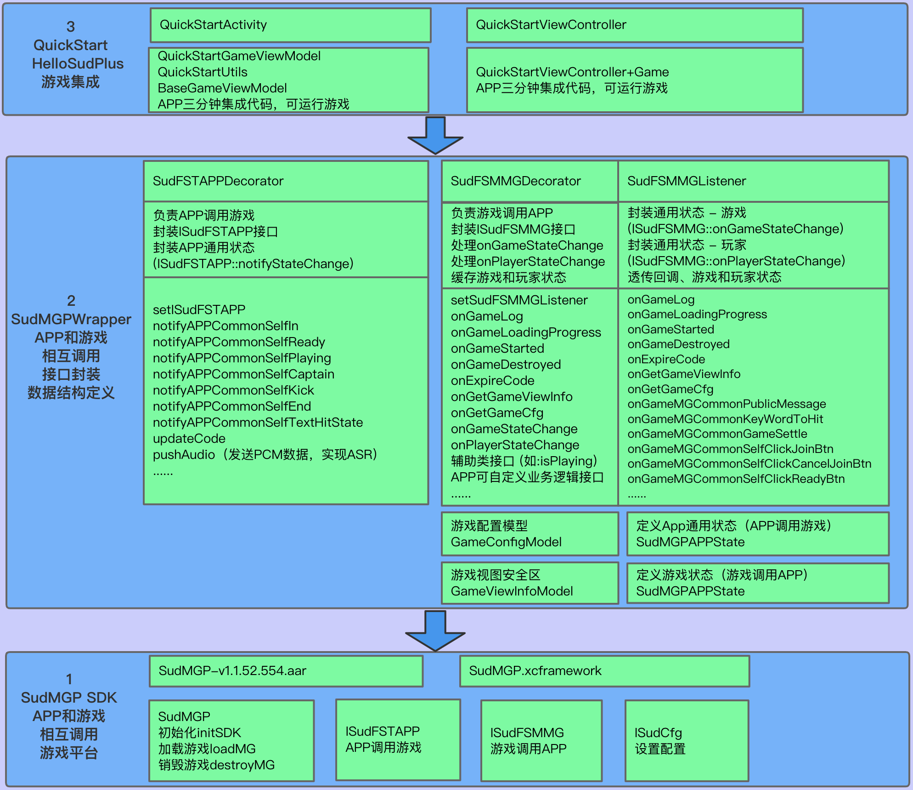
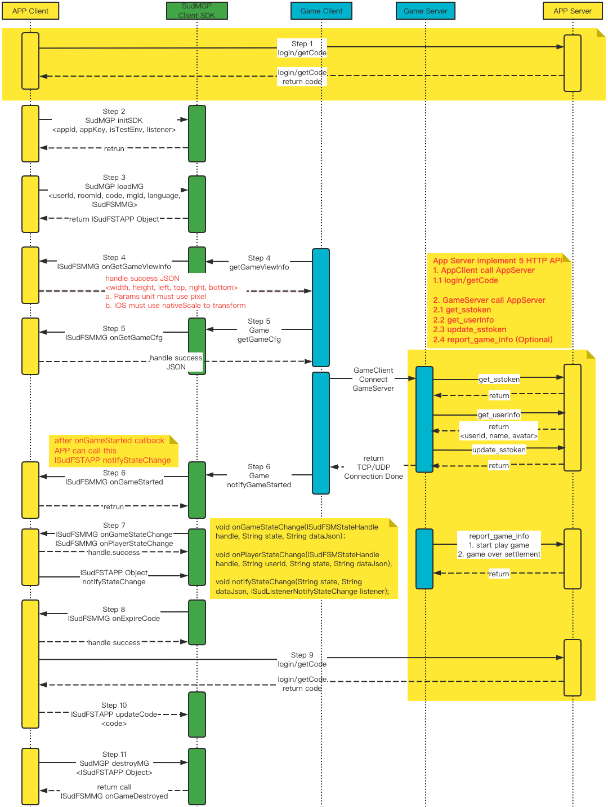

# 开启快速接入和联调SUD游戏之旅

- 第一步：Web端集成SUD游戏（三分钟集成代码）
  <details>
  <summary>详细描述</summary>
  
      1.appId、appKey和isTestEnv=true，请使用QuickStart客户端的；
      2.iOS bundleId、Android applicationId，请使用APP客户端自己的；(接入信息表中的bundleId/applicationId)；
      3.短期令牌code，请使用QuickStart的后端服务（login/getCode获取的）；
      4.完成集成，游戏跑起来;
  
      *** SUD平台支持一个appId绑定多个bundleId和applicationId；***
      *** 填完接入信息表后，SUD会将APP的bundleId和applicationId，绑定到QuickStart的appId上，仅支持测试环境；***
  QuickStart 后端服务[hello-sud-java代码仓库](https://github.com/SudTechnology/hello-sud-java) ，`如果访问不了代码仓库，请联系SUD添加，github账号`；
  </details>


- 第二步：Web端和APP服务端联调
  <details>
  <summary>详细描述</summary>
  
      1.APP服务端实现了5个HTTP API；（接入信息表填的）
      2.请使用Web端自己的appId、appKey、isTestEnv=true、bundleId(iOS)、applicationId(Android)；
      3.请使用Web自己的服务端login/getCode接口，获取短期令牌code；
      4.Web端和APP服务端联调5个HTTP API；
      5.完成HTTP API联调；
  </details>


- 第三步：Web专注于自身业务需求
  <details>
  <summary>详细描述</summary>

      1.参考SudMGP文档、SudMGPWrapper、QuickStart、HelloSud体验Demo（展示多场景，Custom自定义场景）；
      2.专注于APP UI交互、功能是否支持、如何实现
      比如：
      调整游戏View大小、位置；
      调整Web和游戏交互流程，UI元素是否可隐藏，按钮是否可隐藏APP实现，点击事件是否支持拦截回调；
      
      3.专注于Web业务逻辑流程、实现
      比如：
      一局游戏开始如何透传数值类型参数、Key类型参数；（结算）
  
  
  [Web Demo](https://hello-sud.sud.tech/)

  </details>

# 三分钟集成代码

- 第一步：安装SudMGPSDK、SudMGPWrapper
  <details>
  <summary>详细描述</summary>
  
  1. 执行命令 
    ```javascript
      npm install sudmgp-sdk-js sudmgp-sdk-js-wrapper
    ```
  </details>

- 第二步：在项目内导入模块SudMGPSDK、SudMGPWrapper
  <details>
  <summary>详细描述</summary>
  

  ``` javascript
    import { GameConfigModel, SudFSMMGDecorator, SudFSTAPPDecorator, SudFSMMGListener } from 'sudmgp-sdk-js-wrapper'
    // SudMGPWrapper 可以单独导入，也可以按需导入
    // import { SudMGPWrapper } from 'sudmgp-sdk-js-wrapper' 全量导入SudMGPWrapper

    import { SudMGP } from 'sudmgp-sdk-js'

  ```
  </details>


- 第二步：在Demo里面已经有一个成型的[QuickStart](https://github.com/SudTechnology/hello-sud-plus-h5/blob/master/QuickStart/react/src/QuickStart/index.ts)个文件，可以直接复制该代码到项目中导入使用
  <details>
  <summary>详细描述</summary>

      1.修改QuickStart文件内的appId和appKey
      2.web自行实现QuickStart文件内getCode的login（后端服务login/getCode）请求接口的方式
  ```javascript
    /** 使用的UserId。这里随机生成作演示，开发者将其修改为业务使用的唯一userId */
    public userId = Math.floor((Math.random() + 1) * 10000).toString()
    /** Sud平台申请的appId */
    public SudMGP_APP_ID = "1461564080052506636"
    /** Sud平台申请的appKey */
    public SudMGP_APP_KEY = "03pNxK2lEXsKiiwrBQ9GbH541Fk2Sfnc"

    /** true 加载游戏时为测试环境 false 加载游戏时为生产环境 */
    public GAME_IS_TEST_ENV = false
  ```
      3.APP客户端请使用QuickStart后端服务login/getCode；
        *** 实现APP快速加载运行游戏，使用QuickStart服务 ***
        *** SUD平台支持一个appId绑定多个bundleId和applicationId ***
        *** 填完接入信息表后，SUD会将APP的bundleId和applicationId，绑定到QuickStart的appId上，仅支持测试环境 ***
  </details>


- 第三步：在页面上添加挂在元素
    <details>
    <summary>详细描述 /react/src/pc/GameDetail.tsx</summary>

    ```html
      <div>
        <!-- 游戏挂在容器，需自定义宽高样式 -->
        <div id='game'></div>
      </div>
    ```
    </details>


- 第四步：加载游戏
    <details>
    <summary>详细描述 /react/src/hooks/useGameDetail.ts</summary>

    ``` javascript
      import { SDKGameView } from "QuickStart"
      const root = document.getElementById('game') // 获取挂载容器元素
      const gameRoomId = 'xxxx' // 业务自身的roomId
      const gameId = 'xxxxx' // 接入的游戏id
      const userId = Math.floor((Math.random() + 1) * 10000).toString() // 业务自身的userId
      if (root) {
        // 初始化
        const nsdk = new SDKGameView({ root, gameRoomId, gameId, userId })

        nsdk.setSudFSMMGListener({
          onGameStarted() {
            console.log('========自定义的game start=====')
          }
        })
        // 调用login 获取code
        nsdk.login(userId)
      }    
    ```
    </details>


- 第六步：销毁游戏
    <details>
    <summary>详细描述</summary>

    ``` javascript
      root.innerHTML = '' // 清空挂载容器内部元素
      // 执行sdk的销毁方法
      nsdk.onDestroy()
    ```
    </details>

# QuickStart 架构图



# 1. SudMGP SDK

### 1.1 SudMGP Client SDK

- [下载 SudMGP-Android-v1.1.52.554.zip](https://github.com/SudTechnology/sud-mgp-android/releases)
- [下载 SudMGP-iOS-v1.1.52.527.zip](https://github.com/SudTechnology/sud-mgp-ios/releases)

### 1.2 接入文档

- [接入文档](https://docs.sud.tech/zh-CN/app/Client/API/)
- [FAQ](https://docs.sud.tech/zh-CN/app/Client/FAQ/)

# 2. SudMGPWrapper

- `SudMGPWrapper封装SudMGP，简化App和游戏相互调用`；
- `SudMGPWrapper长期维护和保持更新`；
- `推荐APP接入方使用SudMGPWrapper`；
- `SudMGPAPPState`、`SudMGPMGState`、`SudFSMMGListener`、`SudFSMMGDecorator`、`SudFSTAPPDecorator核心类`；

### 2.1 App调用游戏

- `SudMGPAPPState` 封装 [App通用状态](https://docs.sud.tech/zh-CN/app/Client/APPFST/CommonState.html) ；
- `SudFSTAPPDecorator` 封装 [ISudFSTAPP](https://docs.sud.tech/zh-CN/app/Client/API/ISudFSTAPP.html)
  两类接口，[notifyStateChange](https://docs.sud.tech/zh-CN/app/Client/APPFST/CommonState.html) 、 foo；
- `SudFSTAPPDecorator` 负责把每一个App通用状态封装成接口；
    <details>
    <summary>代码框架 class SudFSTAPPDecorator</summary>

    ``` javascript
    public class SudFSTAPPDecorator {
        // iSudFSTAPP = SudMGP.loadMG(AppAudioRoomActivity, userId, roomId, code, gameId, language, sudFSMMGDecorator);
        public setISudFSTAPP(ISudFSTAPP iSudFSTAPP);
        // 1. 加入状态
        public notifyAPPCommonSelfIn(isIn: boolean, seatIndex: number, isSeatRandom: boolean, teamId: number) {

        ...
    
        // 16. 设置游戏中的AI玩家（2022-05-11新增）
        public notifyAPPCommonGameAddAIPlayers(aiPlayers: AIPlayers[], isReady: number)
        public destroyMG();
        public updateCode(code: string, listener: ISudListenerNotifyStateChange)
        ...
    }
    ```
    </details>

### 2.2 游戏调用App

- `SudMGPMGState` 封装 [通用状态-游戏](https://docs.sud.tech/zh-CN/app/Client/MGFSM/CommonStateGame.html)
  和 [通用状态-玩家](https://docs.sud.tech/zh-CN/app/Client/MGFSM/CommonStatePlayer.html) ；
- `SudFSMMGListener` 封装[ISudFSMMG](https://docs.sud.tech/zh-CN/app/Client/API/ISudFSMMG.html) 三类回调函数，onGameStateChange、onPlayerStateChange、onFoo；
- `SudFSMMGListener` 负责把游戏每一个状态封装成单独的回调函数；
    <details>
    <summary>代码框架 interface SudFSMMGListener</summary>

    ``` javascript
    interface SudFSMMGListener {
        onGameLog(str: string): void
        onGameStarted();
        onGameDestroyed();
        onExpireCode(handle: ISudFSMStateHandle, dataJson: string): void
        onGetGameViewInfo(handle: ISudFSMStateHandle, dataJson: string): void
        onGetGameCfg(handle: ISudFSMStateHandle, dataJson: string): void
    
        // 通用状态 - 游戏
        // void onGameStateChange(ISudFSMStateHandle handle, String state, String dataJson)；
        // 文档: https://docs.sud.tech/zh-CN/app/Client/MGFSM/CommonStateGame.html
        // 1.游戏公屏消息
       onGameMGCommonPublicMessage?(handle: ISudFSMStateHandle, model: IMGCommonPublicMessage) 

        ...
    
        // 21. 游戏通知app层添加陪玩机器人是否成功（2022-05-17新增）
        onGameMGCommonGameAddAIPlayers?(handle: ISudFSMStateHandle, model: IMGCommonGameAddAIPlayers)

        
        // 通用状态 - 玩家
        // void onPlayerStateChange(ISudFSMStateHandle handle, String userId, String state, String dataJson);
        // 文档: https://docs.sud.tech/zh-CN/app/Client/MGFSM/CommonStatePlayer.html
        // 1.加入状态
        onPlayerMGCommonPlayerIn?(handle: ISudFSMStateHandle, userId: string, model: IMGCommonPlayerIn)
        ...
    
        // 11. 游戏通知app层当前游戏剩余时间（2022-05-23新增，目前UMO生效）
        onPlayerMGCommonGameCountdownTime?(handle: ISudFSMStateHandle, userId: string, model: IMGCommonGameCountdownTime)
    
        // 游戏个性化状态：你画我猜
        // 文档：https://docs.sud.tech/zh-CN/app/Client/MGFSM/DrawGuess.html
        // 1. 选词中状态
        onPlayerMGDGSelecting?(handle: ISudFSMStateHandle, userId: string, model: IMGDGSelecting)
        ...
    }
    ```
    </details>
- [ISudFSMMG](https://docs.sud.tech/zh-CN/app/Client/API/ISudFSMMG.html) 的装饰类`SudFSMMGDecorator`，负责派发每一个游戏状态，缓存需要的游戏状态；
    <details>
    <summary>代码框架 class SudFSMMGDecorator</summary>

    ``` javascript
    public class SudFSMMGDecorator implements ISudFSMMG {
        // 设置回调
        public setSudFSMMGListener(listener: Partial<SudFSMMGListener>)
        // 游戏日志
        onGameLog(str: string): void
        // 游戏加载进度
        public onGameLoadingProgress(stage: number, retCode: number, progress: number)
        // 游戏已开始，游戏长连接完成
        public onGameStarted();
        // 游戏销毁
        public onGameDestroyed();
        // Code过期，必须实现；APP接入方必须调用handle.success，释放异步回调对象
        public onExpireCode(handle: ISudFSMStateHandle, dataJson: string): void
        // 获取游戏View信息，必须实现；APP接入方必须调用handle.success，释放异步回调对象
        // GameViewInfoModel文档: https://docs.sud.tech/zh-CN/app/Client/API/ISudFSMMG/onGetGameViewInfo.html
        public onGetGameViewInfo(handle: ISudFSMStateHandle, dataJson: string)
        // 获取游戏Config，必须实现；APP接入方必须调用handle.success，释放异步回调对象
        // GameConfigModel文档: https://docs.sud.tech/zh-CN/app/Client/API/ISudFSMMG/onGetGameCfg.html
        public  onGetGameCfg(handle: ISudFSMStateHandle, dataJson: string): void
        // 游戏状态变化；APP接入方必须调用handle.success，释放异步回调对象
        public onGameStateChange(handle: ISudFSMStateHandle, state: string, dataJson: string)
        // 游戏玩家状态变化，APP接入方必须调用handle.success，释放异步回调对象
        public onPlayerStateChange(handle: ISudFSMStateHandle, userId: string, state: string, dataJson: string)
  
        ...
    }
    ```
    </details>

# 3. QuickStart

- 请使用QuickStart项目运行；
- QuickStart使用SudMGPWrapper、SudMGPSDK实现快速接入游戏；
- 快速接入文档：[StartUp-Android](https://docs.sud.tech/zh-CN/app/Client/StartUp-Android.html)
  、 [StartUp-iOS](https://docs.sud.tech/zh-CN/app/Client/StartUp-iOS.html) 、[StartUp-Web](https://docs.sud.tech/zh-CN/app/Client/StartUp-Web.html)
- `QuickStartGameViewModel` 负责login(App getCode) --> SudMGP.initSDK --> SudMGP.loadMG；
- `QuickStart 服务端` [hello-sud-java](https://github.com/SudTechnology/hello-sud-java) ，login(App getCode 获取短期令牌code) ，`如果访问不了代码仓库，请联系SUD添加，github账号`；


- HelloSud体验Demo（展示多业务场景）


# 5. 接入方客户端和SudMGP SDK调用时序图



